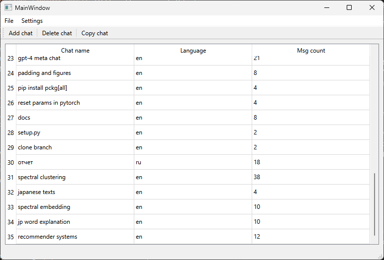
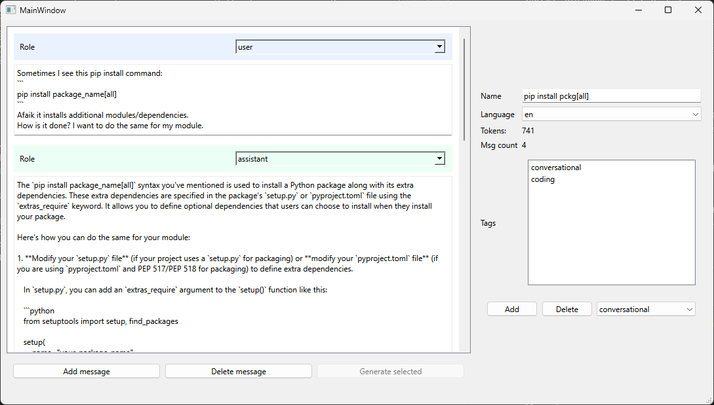
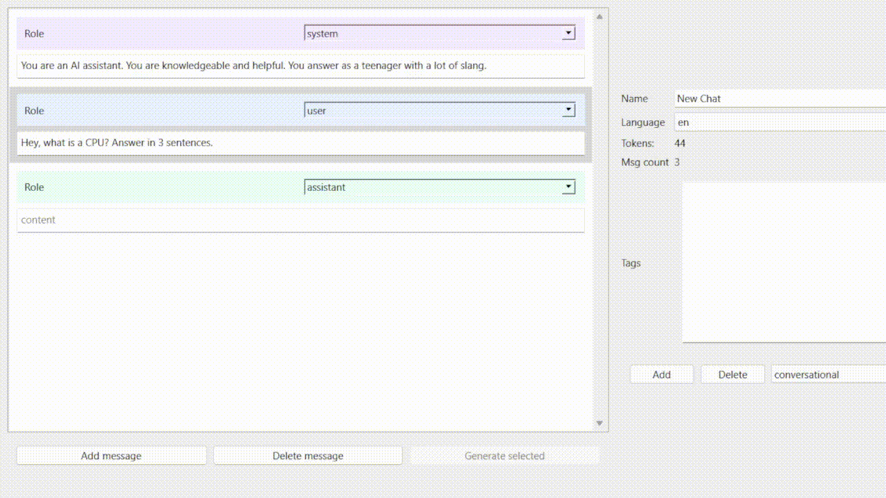
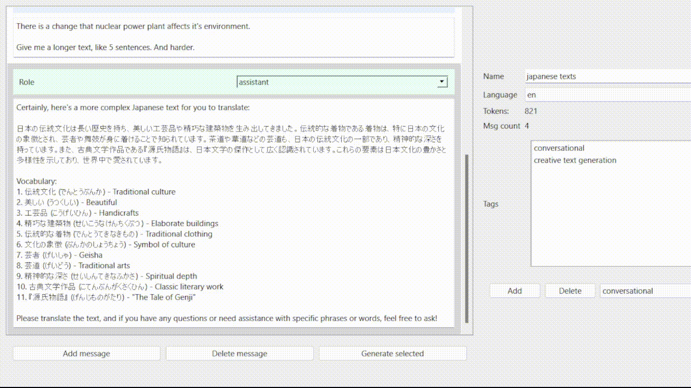

# LIMA-GUI

LIMA-GUI is a simple utility for gathering [LIMA](https://arxiv.org/pdf/2305.11206.pdf)-like data to train you own personal AI (based on LLAMA, MPT or others).

It uses a simple data format that closely resembles OpenAI API. Chat is represented as a list of JSONs:
```json
[
    {
        "role": "role",
        "content": "content"
    }
]
```

Example chat:
```json
[
    {
        "role": "user",
        "content": "Hey, what is 4 + 4?"
    },
    {
        "role": "assistant",
        "content": "Hey! 4 + 4 is 8."
    }
]
```

## Motivation

I strongly believe in personalized AI tailored to the user's personal preferences and use cases. Having your own AI is way better instead of relying on others' work as you have full control and customization freedom. 
Though making one takes considerable effort and lots of compute. It used to take tens of thousands of examples (at the very least) to train an AI assistant, but now we have:
- [`LIMA: Less Is More for Alignment`](https://arxiv.org/pdf/2305.11206.pdf). The paper has shown that it is possible to create a decent AI assistant using only a handful of curated examples (around 1000 samples). kaiokendev confirmed that LIMA actually works [kaiokendev's findings](https://kaiokendev.github.io/til).
- [`LORA: LOW-RANK ADAPTATION OF LARGE LANGUAGE MODELS`](https://arxiv.org/pdf/2106.09685.pdf) and [`QLORA: Efficient Finetuning of Quantized LLMs`](https://arxiv.org/pdf/2305.14314.pdf). No more bazilion gigabytes of memory needed, a high-grade consumer level GPU (like RTX 3090) should do the trick.

So if the off-the-shelf AIs aren't doing it for you, here is the recipe:
1. Good foundational LLM (which are plenty right now).
2. Some compute (even colab might suffice).
3. Your own unique data.

Now, the last part is a bit tricky. In my case I need a `hand-crafted multi-turn chat dataset` (public ones don't do). From what I've seen, there's a real lack of tools to help collect this kind of data. A lot of them are stuck in the basic Alpaca format or can be a bit unwieldy—great for big teams, maybe not so much for solo devs.

That's why I decided to make my own tool, keeping things straightforward:
- A user-friendly UI for managing chat data.
- An easy-to-use data storage format that's on good terms with huggingface.
- Integration with the OpenAI API to help with data collection.

## LIMA-GUI functionality

LIMA-GUI allows you to manage manually curated (basically hand written) chat data. Main window:



I guess the UI here is mostly self-explanatory, though here is an explicit list of things you can see/do:
- A list of chats.
- You can add, delete, copy chats.
- In the file menu you'll see `Open` and `Save` options.
- In the settings menu you can tweak some of the app settings as well as OpenAI API configuration.

Double-clicking on a chat opens a chat window:



Chat is represented as a list of messages and can be seen on the left. Each message is given a role: 
- `system` - system prompt (for steering the model's behaviour, priming, etc).
- `user` - user message.
- `assistant` - AI's reply.

On the right you can see some of the chat's properties:
- `Name` - a short description of the chat.
- `Language` - primary language in the chat (currently ru and en are supported, I'll make it configurable later).
- `Tokens` - approximate number of tokens in the chat. It is being computed using a huggingface tokenizer that's set in the settings menu ('llama-2-7b' tokenizer is used by default). I need my AI to operate with long contexts, so this stat is really helpful for me.
- `Msg count` - number of messages in the chat.
- `Tags` - well, it's a list of tags for the chat. It helps to classify individual chats and split the dataset appropriately if needed.

The coolest thing is that while crafting your own data, you can use OpenAI's models (or any other that are hosted via OpenAI API) to assist you during the process. You have two options:
1. Generate full assistant's reply (using chat API).

2. Generate a part of the reply (using completion API).


Other important things:
- Shortcut for saving current dataset: `Ctrl + S`.
- Shortcut for opening a dataset file: `Ctrl + R`.
- You can replace the API base for the OpenAI API. Meaning you can host you own model to help you in your endeavors (I haven't tested it yet though, but it should work). The only requirement is that the hosting framework of your choice should mimic OpenAI API format. I am using [SimpleAI](https://github.com/lhenault/simpleAI) and it works great for me.
- See the jupyter notebook (`data_loading.ipynb`) in the examples folder for a small showcase of how you can load your data at the moment.

## Caution

The project is still in its early stages, so expect a few bumps along the road. For instance, you'll need to manually save your data (Ctrl + S) to avoid losing changes. The program won't prompt you to save when exiting. Nevertheless, I've found the current feature set to be super handy (at least for my needs).

I'm still busy gathering data and haven't dived into training models yet. This means the API for loading data might be a tad clunky for now. However, the underlying data format is pretty straightforward, so if needed you can make up your own data parser in minutes.

On the horizon: I'm looking to integrate Huggingface with LIMA-GUI. Specifically, I want to create a custom data loader that plays nice with HF data APIs.

## Usage

1. Download the latest release (main branch is likely to less stable).
2. Install the lima-gui by running `pip install -e .` in the repo folder.
3. Run `python -m lima_gui.app`

If you experience any problem, please make a corresponding issue.

## TODO

- [ ] Safeguards not to lose data.
    - [ ] Automatic saving (optional).
    - [ ] Asking to save if haven't already.
    - [ ] Ctrl + S should save in an already opened file.
    - [ ] Show somewhere little message "Saved".
- [ ] Somehow refactor current shitty chat UI.
    - [x] Make scrolling smooth.
    - [x] Make list items fit message contents.
    - [x] Scrolling at the end of the list on opening.
    - [ ] Select/Focus newly added item.
    - [ ] Scroll down the focused ChatItem during AI text generation.
    - [ ] Automatically focus the item you are typing in.
- [ ] Huggingface integration (download/upload the dataset).
- [ ] Deletion of multiple 
- [x] Token count using Huggingface tokenizers (LLAMA tokenizer by default).
- [ ] Manual on how to use lima-gui.
- [x] Tags for chats (like coding, logic, qa, etc).
- [x] Default dataset config (contains config for languages, tags and tokenizer).
- [x] OpenAI API integration to allow for AI generated answers.
    - [x] Chat API support.
    - [x] Completion API support.
    - [ ] Token count support.
    - [ ] Stopping generation (!).
    - [ ] Function calling.
        - [ ] Proper UI for function call messages.
        - [ ] Function roles.
- [x] Keep tabulation.
- [ ] Save settings/current config.
- [ ] Import ChatGPT exported dialogues.
- [ ] Stats board that shows various useful statistics about current data (token count distribution, number of samples by tags/languages).

## Pull requests

Any changes that simplify or make data gathering more comfortable (UI/UX, QoL, tools, etc) are welcome.